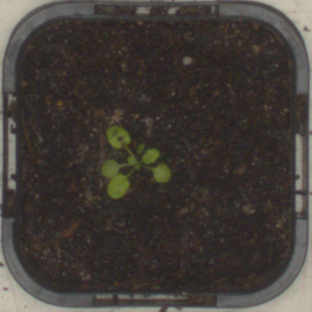

# Regression in Convolution Neural Network Applied to Plant Leaf Count

[](https://travis-ci.org/keras-team/keras)
[](https://www.tensorflow.org/api_docs/)


## Table of Contents

- [Dataset](##dataset)
- [Experiments](##experiments)
- [Getting Started](##gettingstarted)
- [Some Results](##someresults)
- [License](##license)
- [Acknowledgement](##acknowledgement)
- [Reference](##reference)


## Dataset

<p align="center">


</p>
<h6 align="center"> Example of the dataset used for these experiments. For more details about the dataset you can visite the <a href="https://www.plant-phenotyping.org/CVPPP2017-CFP">CVPP</a> web site.</h6>

This repository contains some of experiments used for evaluating the regression with cnn (__Convolutional Neural Networks__) for counting better leafs. The dataset was available of the contents __Computer Vision Problems in Plant Phenotyping__.

As result one paper was produced and publicated in the WorkShop of Computer Vision (2019) where you can ready in the following link([da Silva and Gonçalvez (2019)](https://doi.org/10.5753/wvc.2019.7627)).

__Note:__ this paper was writer 80% in Portuguese, so is crucial you understand this language.


## Experiments
**Bellow is a description about the experiments:**
<ul> 
    <li> Python script and Jupyter notebook;
    <li> Was used a desktop computer with
Intel(R) Xeon(R) CPU E3-1270@3.80 GHz, 64 GB memory, and NVIDIA
Titan V graphics card (5120 Compute Unified Device Architecture -
CUDA cores and 12 GB graphics memory). The methods were implemented
using Keras-Tensorflow on the Ubuntu 18.04 operating
system.
</ul>

## Getting Started

### Install the following packages

  * Sklearn 0.22.2.
  ```
    $ pip install -U scikit-learn
  ```
  * TensorFlow
  ```
    $ pip install tensorflow
  ```
  * Keras
  ```
    $ pip install keras
  ```
  * Matplotlib
  ```
    $ python -m pip install -U matplotlib
  ```
  * Os
  ```
    $ pip install os-sys
  ```
  * Skimage
  ```
    $ pip install scikit-image
  ```

### Run

> For run the experiment you need to access the respective architecture folder first, you can choose bellow the best way for run.

If you need run jupyter:
```
    jupyter-notebook name_experiment.ipynb 
```

You can run using python script also:
```
    python name_experiment.py
```

## Some Results

Bellow, follow two results that have been applied to the test set using the architecture __Xception__, and the metrics used was __MAE__ (Mean Absolute error) and __R2__ (Coefficient of Determination):

| __Architecture__ | __Mean Squared Error__| __Mean Absolute Error__ | __Coefficient of Determination__|
|:-------------:|:-------------:|:-------------:|:-------------:|
|__Xception__ | 1.09 | 0.46     | 0.96|


## Acknowledgement

<p align="justify">Thanks for the teacher <b>PhD Wesley Nunes Gonçalvez</b> for contributing for this developer.</p>

## License

[](http://badges.mit-license.org)

- **[MIT license](http://opensource.org/licenses/mit-license.php)**

## References

[1]:da Silva, Neemias Bucéli, and Wesley Nunes Gonçalves. "Regression in Convolutional Neural Networks applied to Plant Leaf Counting." Anais do XV Workshop de Visão Computacional. SBC, 2019.

#

<p align="center">Sincerely <a href="https://github.com/neemiasbsilva"> Neemias B. Silva</a>.</p>
